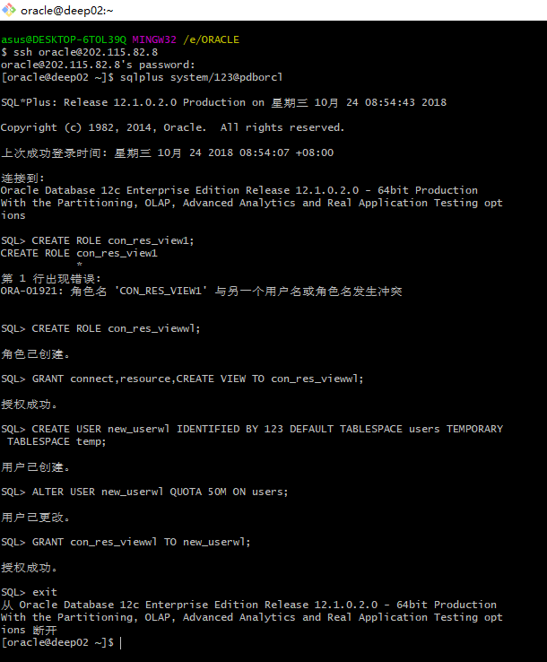
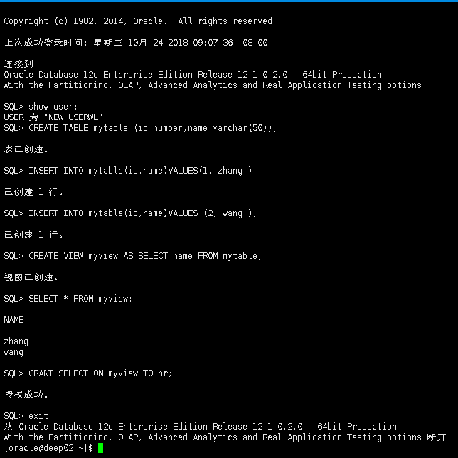
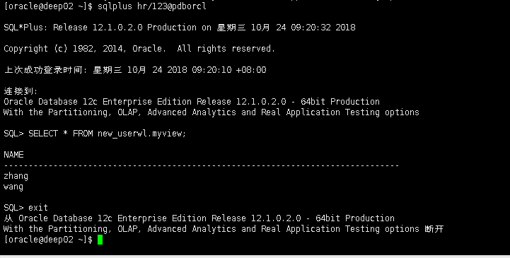
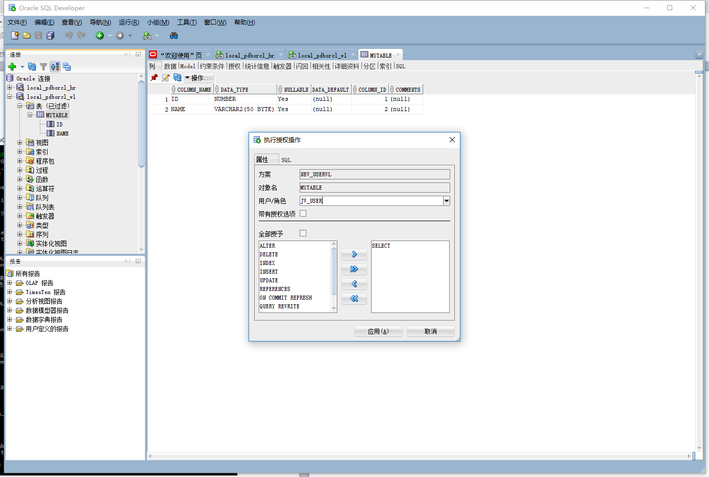
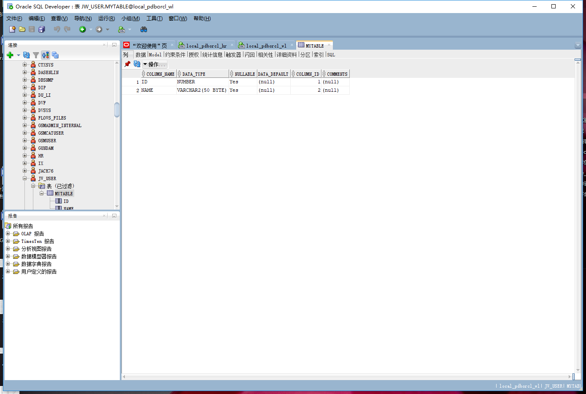
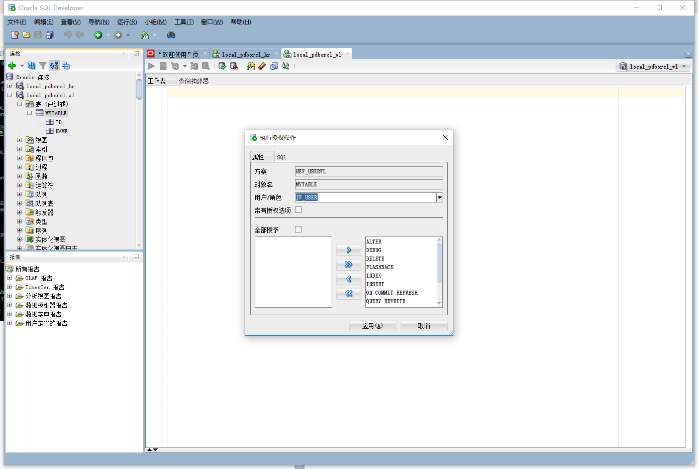
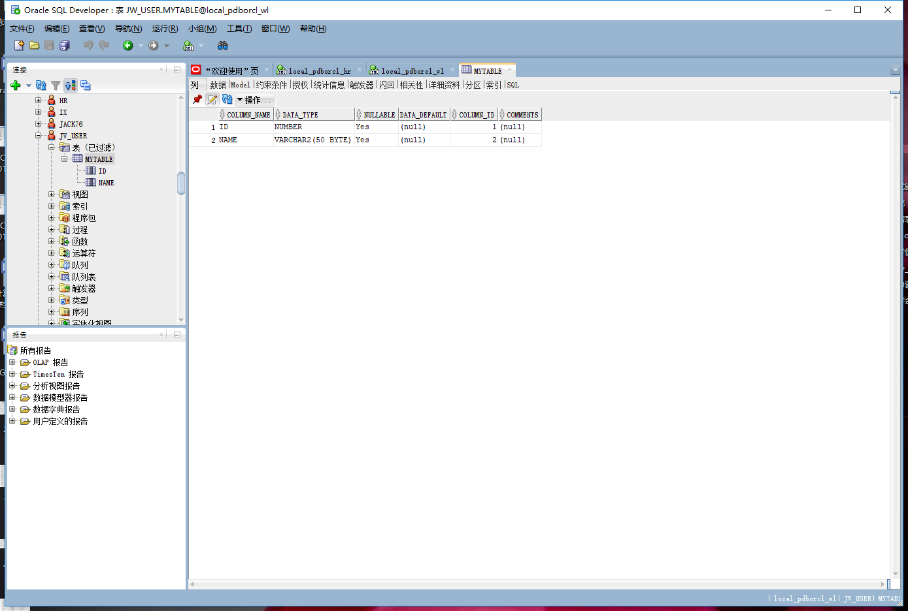
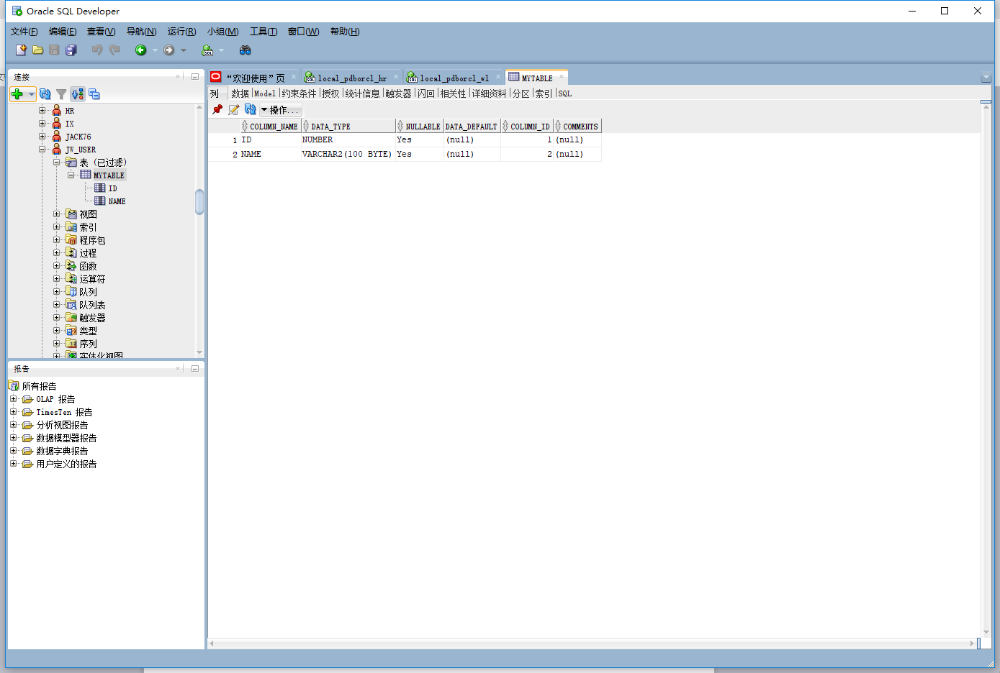
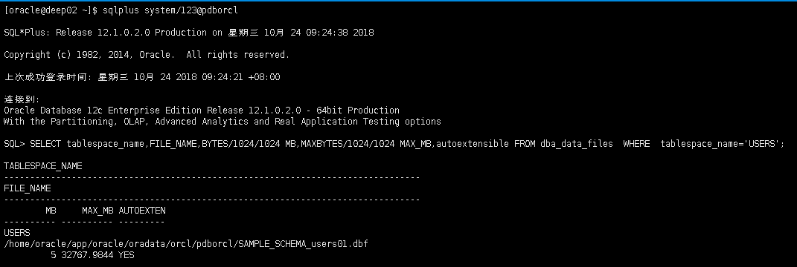
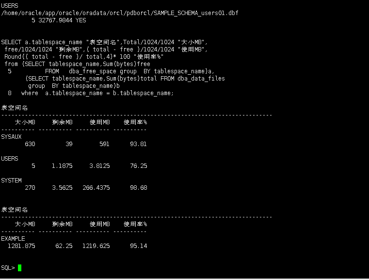

# 实验步骤:

## Oracle地址：202.115.82.8    
## 用户名：system,hr,new_userwl    
## 密码123    
## 数据库名称：pdborcl     
## 端口号：1521

- 第1步:以system登录到pdborcl，创建角色con_res_viewwl和用户new_userwl，并授权和分配空间(其中：授权new_userwl用户访问users表空间，空间限额是50M)：

- 第2步：新用户new_userwl连接到pdborcl，创建表mytable和视图myview，插入数据，最后将myview的SELECT对象权限授予hr用户。

- 第3步：用户hr连接到pdborcl，查询new_userwl授予它的视图myview：

- 测试一下同学用户之间的表的共享，只读共享和读写共享都测试一下:

只读共享:

- 给jw_user授权只读操作：

- jw_user给我授权只读操作后，查看jw_user创建的表。

读写共享；

- 给jw_user授权读写操作：

- jw_user给我授权读写操作后，查看jw_user创建的表。

- jw_user给我授权读写操作后，修改jw_user创建的表，将其name的字符长度从50byte改成100byte。

# 查看数据库的使用情况：
以下sql语句查看表空间的数据库文件，以及每个文件的磁盘占用情况。
- autoextensible是显示表空间中的数据文件是否自动增加。
- MAX_MB是指数据文件的最大容量。

- 通过以上的sql语句可以查看表空间的数据库文件，以及每个文件的磁盘占用情况。其中，通过autoextensible语句执行的结果可以看出表空间中的数据文件已经自动增加了。而且还可以通过MAX_MB语句执行的结果显示出数据文件的最大容量为532767.9844M。
