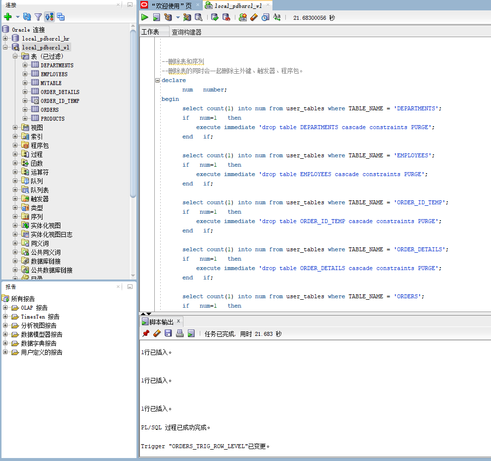
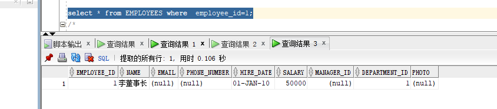
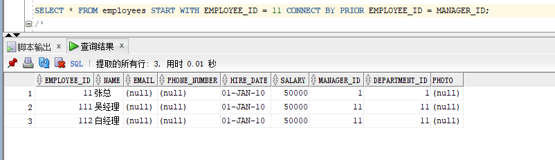
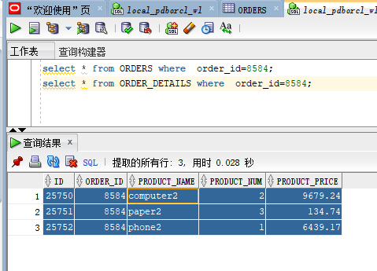
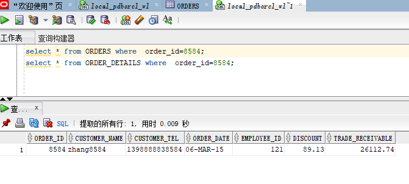
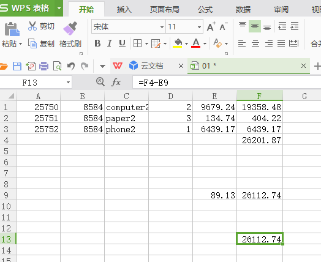
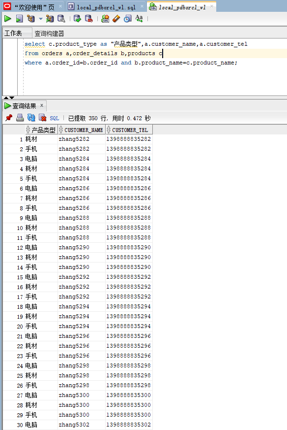
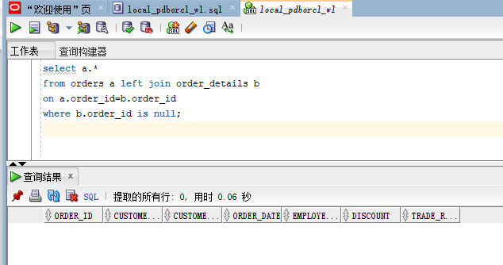
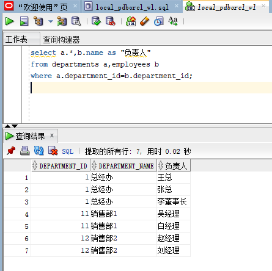
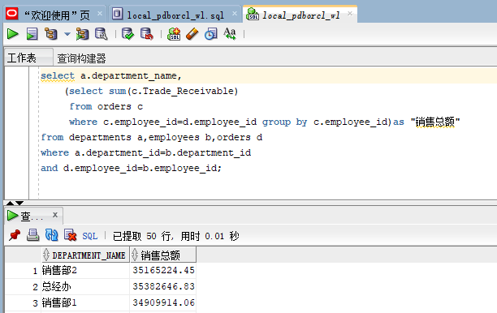

# 实验4：对象管理

## - 用户名：NEW_USERWL

## - 实验内容：
### 录入数据：
要求至少有1万个订单，每个订单至少有4个详单。至少有两个部门，每个部门至少有1个员工，其中只有一个人没有领导，一个领导至少有一个下属，并且它的下属是另一个人的领导（比如A领导B，B领导C）。

###  序列的应用
插入ORDERS和ORDER_DETAILS 两个表的数据时，主键ORDERS.ORDER_ID, ORDER_DETAILS.ID的值必须通过序列SEQ_ORDER_ID和SEQ_ORDER_ID取得，不能手工输入一个数字。

###  触发器的应用：
维护ORDER_DETAILS的数据时（insert,delete,update）要同步更新ORDERS表订单应收货款ORDERS.Trade_Receivable的值。

###  查询数据：
 1.查询某个员工的信息。
 
 2.递归查询某个员工及其所有下属，子下属员工。
 
 3.查询订单表，并且包括订单的订单应收货款: Trade_Receivable= sum(订单详单表.ProductNum*订单详单表.ProductPrice)- Discount。
 
 4.查询订单详表，要求显示订单的客户名称和客户电话，产品类型用汉字描述。
 
 5.查询出所有空订单，即没有订单详单的订单。
 
 6.查询部门表，同时显示部门的负责人姓名。
 
 7.查询部门表，统计每个部门的销售总金额。

## - 实验步骤：
- 首先，先进行检测是否存在相同名字的表，如果存在就删除表；然后，建立这个单位的部分信息：员工表，部门表，订单表，订单详单表以及录入数据（一万行数据）、序列的应用、触发器的应用：

#### 注意：具体实现代码见实验四中的SQL语句。



- 查询数据：

1.查询某个员工的信息:
```sql
select * from EMPLOYEES where employee_id=1;
```


2.递归查询某个员工及其所有下属，子下属员工：
```sql
SELECT * FROM employees START WITH EMPLOYEE_ID = 11 CONNECT BY PRIOR EMPLOYEE_ID = MANAGER_ID;
```


3.查询订单表，并且包括订单的订单应收货款: Trade_Receivable= sum(订单详单表.ProductNum*订单详单表.ProductPrice)- Discount：

A.查询某一个订单详表ORDER_DETAILS:
```sql
select * from ORDER_DETAILS where  order_id=8584;
```


B.查询某一个订单表ORDERS：
```sql
select * from ORDERS where  order_id=8584;
```


对以上的查询结果进行验证：



4.查询订单详表，要求显示订单的客户名称和客户电话，产品类型用汉字描述：
```sql
select c.product_type as "产品类型",a.customer_name,a.customer_tel
from orders a,order_details b,products c
where a.order_id=b.order_id and b.product_name=c.product_name;
```


5.查询出所有空订单，即没有订单详单的订单：
```sql
select a.*
from orders a left join order_details b
on a.order_id=b.order_id
where b.order_id is null;
```


6.查询部门表，同时显示部门的负责人姓名：
```sql
select a.*,b.name as "负责人"
from departments a,employees b
where a.department_id=b.department_id; 
```


7.查询部门表，统计每个部门的销售总金额：
```sql
select a.department_name,
    (select sum(c.Trade_Receivable)
     from orders c 
     where c.employee_id=d.employee_id group by c.employee_id)as "销售总额"
from departments a,employees b,orders d
where a.department_id=b.department_id
and d.employee_id=b.employee_id;
```

