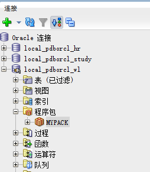
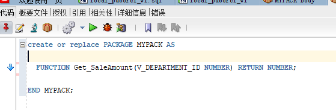
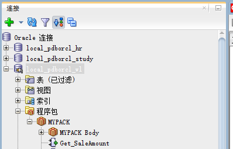
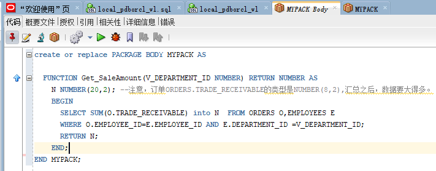
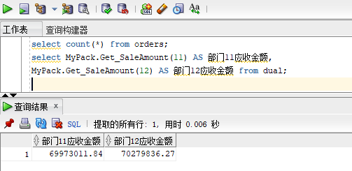
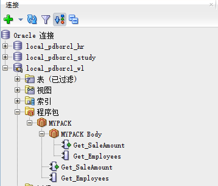
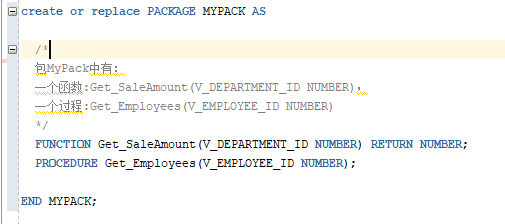
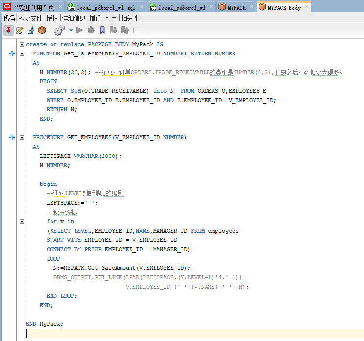
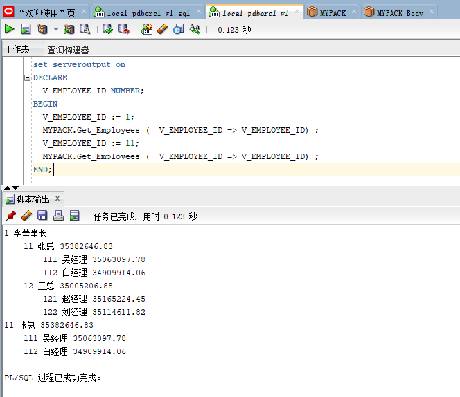

# 实验五：PL/SQL编程
## 用户名：NEW_USERWL
## 实验步骤：

1.创建一个包(Package)，包名是MyPack。

2.在MyPack中创建一个函数SaleAmount ，查询部门表，统计每个部门的销售总金额，每个部门的销售额是由该部门的员工(ORDERS.EMPLOYEE_ID)完成的销售额之和。函数SaleAmount要求输入的参数是部门号，输出部门的销售金额。

- 在包中创建一个函数:Get_SaleAmount(V_DEPARTMENT_ID NUMBER)：

- 创建包主体：

- 函数Get_SaleAmount()测试方法：

3.在MyPack中创建一个过程，在过程中使用游标，递归查询某个员工及其所有下属，子下属员工。过程的输入参数是员工号，输出员工的ID,姓名，销售总金额。信息用dbms_output包中的put或者put_line函数。输出的员工信息用左添加空格的多少表示员工的层次（LEVEL）。

- 在包中创建一个过程:Get_Employees(V_EMPLOYEE_ID NUMBER)：

- 创建包主体：

- 过程Get_Employees()测试代码：

4.由于订单只是按日期分区的，上述统计是全表搜索，因此统计速度会比较慢，如何提高统计的速度呢？

可以通过创建部门管理的 B-树索引加快搜索速度.
