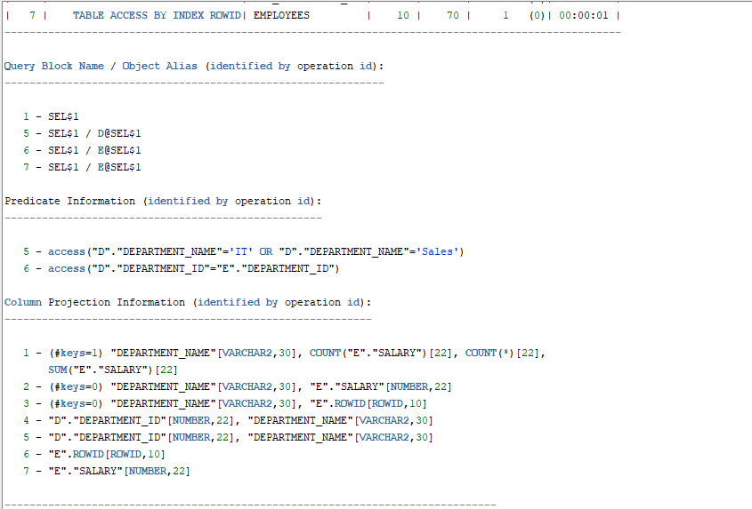
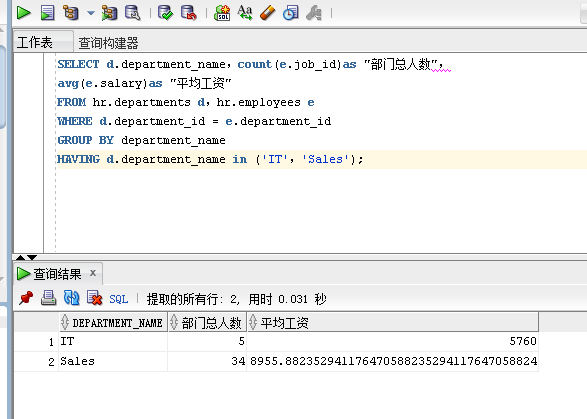
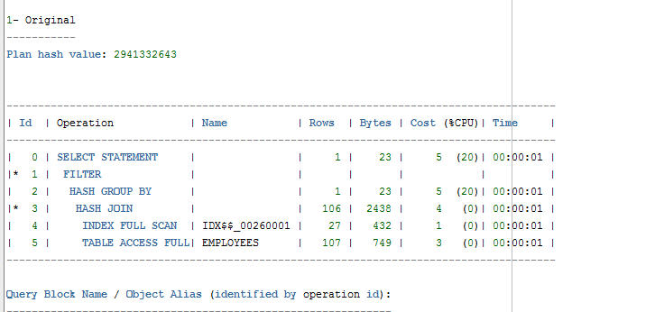
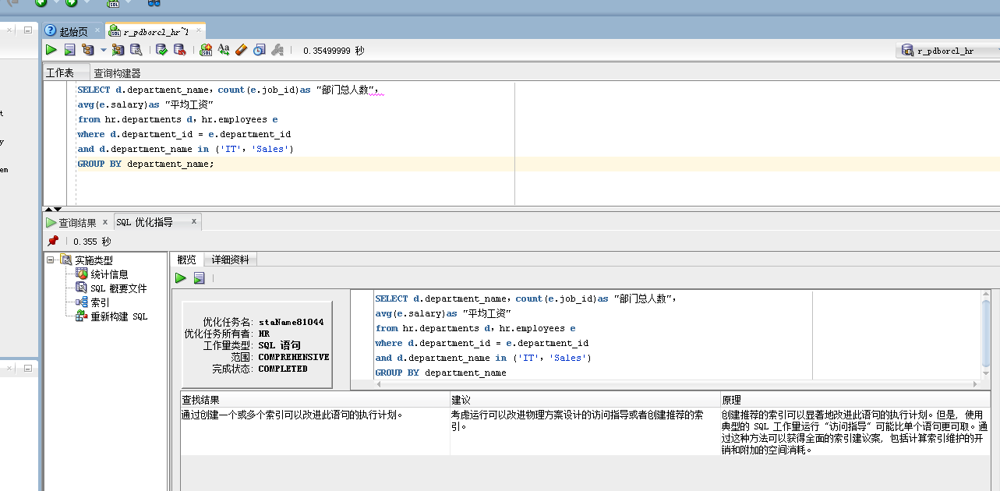

# 查询1：

- 查询结果：

- 执行计划：

其中：cost=2，rows=437,Predicate Information(谓词信息）中有一次索引access，一次全表搜索filter。

# 查询2：

- 查询结果：

- 执行计划：

其中：cost=5，rows=106,Predicate Information(谓词信息）中有一次索引access，两次全表搜索filter。

通过对以上两个查询的执行计划进行比较，查询1中cost=2，查询2中cost=5，二者相比，查询1中的cost更小，即：它的成本更低，因为成本越低越好，所以查询1的QL语句是最优的。

- 查询1进行优化指导：

