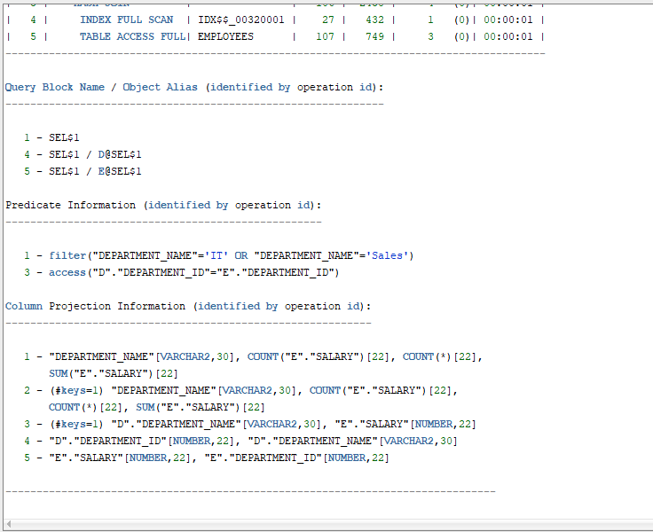
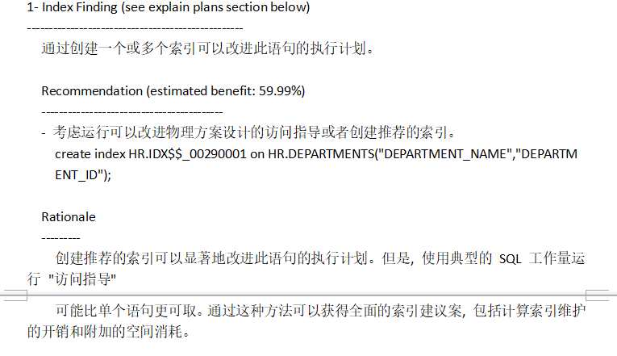

# 查询1：
```sql
SELECT d.department_name，count(e.job_id)as "部门总人数"，
avg(e.salary)as "平均工资"
from hr.departments d，hr.employees e
where d.department_id = e.department_id
and d.department_name in ('IT'，'Sales')
GROUP BY department_name;
```

- 查询结果：


- 执行计划：

其中：cost=2，rows=20,Predicate Information(谓词信息）中有一次索引access，一次全表搜索filter。


# 查询2：
```sql
SELECT d.department_name，count(e.job_id)as "部门总人数"，
avg(e.salary)as "平均工资"
FROM hr.departments d，hr.employees e
WHERE d.department_id = e.department_id
GROUP BY department_name
HAVING d.department_name in ('IT'，'Sales');
```

- 查询结果：


- 执行计划：

其中：cost=5，rows=106,Predicate Information(谓词信息）中有一次索引access，两次全表搜索filter。




从分析两个SQL语句可以看，查询1是先过滤后汇总（where子句），参与汇总与计算的数据量少。而查询2是先汇总后过滤（having子句），参与汇总与计算的数据量多。且通过对以上两个查询的执行计划进行比较，查询1中cost=2，查询2中cost=5，二者相比，查询1中的cost更小，即：它的成本更低，因为成本越低越好，所以查询1的QL语句是最优的。

- 对查询1进行优化指导：


```sql
GENERAL INFORMATION SECTION
-------------------------------------------------------------------------------
Tuning Task Name   : staName35891
Tuning Task Owner  : HR
Tuning Task ID     : 11
Workload Type      : Single SQL Statement
Execution Count    : 1
Current Execution  : EXEC_1
Execution Type     : TUNE SQL
Scope              : COMPREHENSIVE
Time Limit(seconds): 1800
Completion Status  : COMPLETED
Started at         : 10/16/2018 11:27:51
Completed at       : 10/16/2018 11:27:52

-------------------------------------------------------------------------------
Schema Name   : HR
Container Name: PDBORCL
SQL ID        : gv51ddmnrkrj6
SQL Text      : SELECT d.department_name，count(e.job_id)as "部门总人数",
                avg(e.salary)as "平均工资"
                from hr.departments d,hr.employees e
                where d.department_id = e.department_id
                and d.department_name in ('IT','Sales')
                GROUP BY department_name

-------------------------------------------------------------------------------
FINDINGS SECTION (1 finding)
-------------------------------------------------------------------------------

1- Index Finding (see explain plans section below)
--------------------------------------------------
  通过创建一个或多个索引可以改进此语句的执行计划。

  Recommendation (estimated benefit: 59.99%)
  ------------------------------------------
  - 考虑运行可以改进物理方案设计的访问指导或者创建推荐的索引。
    create index HR.IDX$$_000B0001 on HR.DEPARTMENTS("DEPARTMENT_NAME","DEPARTM
    ENT_ID");

  Rationale
  ---------
    创建推荐的索引可以显著地改进此语句的执行计划。但是, 使用典型的 SQL 工作量运行 "访问指导"
    可能比单个语句更可取。通过这种方法可以获得全面的索引建议案, 包括计算索引维护的开销和附加的空间消耗。

-------------------------------------------------------------------------------
```
# 自定义查询语句:

查询所有部门的名字，location_id，员工数量和工资平均值
 ```sql
 Select department_name,location_id,count(e.job_id) as "部门总人数",avg(e.salary) as "平均工资" 
from departments d,employees e
where d.department_id=e.department_id 
group by department_name,location_id;
--------------------- 
```
- 查询结果：



- 执行计划：
```sql
GENERAL INFORMATION SECTION
-------------------------------------------------------------------------------
Tuning Task Name   : staName15914
Tuning Task Owner  : HR
Tuning Task ID     : 442
Workload Type      : Single SQL Statement
Execution Count    : 1
Current Execution  : EXEC_433
Execution Type     : TUNE SQL
Scope              : COMPREHENSIVE
Time Limit(seconds): 1800
Completion Status  : COMPLETED
Started at         : 10/18/2018 11:38:07
Completed at       : 10/18/2018 11:38:08

-------------------------------------------------------------------------------
Schema Name   : HR
Container Name: PDBORCL
SQL ID        : a99hwdd63sg47
SQL Text      : Select department_name,location_id,count(e.job_id) as
                "部门总人数",avg(e.salary) as "平均工资" 
                from departments d,employees e
                where d.department_id=e.department_id 
                group by department_name,location_id

-------------------------------------------------------------------------------
There are no recommendations to improve the statement.

-------------------------------------------------------------------------------
EXPLAIN PLANS SECTION
-------------------------------------------------------------------------------

1- Original
-----------
Plan hash value: 1139150879

 
---------------------------------------------------------------------------------------------
| Id  | Operation                     | Name        | Rows  | Bytes | Cost (%CPU)| Time     |
---------------------------------------------------------------------------------------------
|   0 | SELECT STATEMENT              |             |    27 |   702 |     7  (29)| 00:00:01 |
|   1 |  HASH GROUP BY                |             |    27 |   702 |     7  (29)| 00:00:01 |
|   2 |   MERGE JOIN                  |             |   106 |  2756 |     6  (17)| 00:00:01 |
|   3 |    TABLE ACCESS BY INDEX ROWID| DEPARTMENTS |    27 |   513 |     2   (0)| 00:00:01 |
|   4 |     INDEX FULL SCAN           | DEPT_ID_PK  |    27 |       |     1   (0)| 00:00:01 |
|*  5 |    SORT JOIN                  |             |   107 |   749 |     4  (25)| 00:00:01 |
|   6 |     TABLE ACCESS FULL         | EMPLOYEES   |   107 |   749 |     3   (0)| 00:00:01 |
---------------------------------------------------------------------------------------------
 
Query Block Name / Object Alias (identified by operation id):
-------------------------------------------------------------
 
   1 - SEL$1
   3 - SEL$1 / D@SEL$1
   4 - SEL$1 / D@SEL$1
   6 - SEL$1 / E@SEL$1
 
Predicate Information (identified by operation id):
---------------------------------------------------
 
   5 - access("D"."DEPARTMENT_ID"="E"."DEPARTMENT_ID")
       filter("D"."DEPARTMENT_ID"="E"."DEPARTMENT_ID")
 
Column Projection Information (identified by operation id):
-----------------------------------------------------------
 
   1 - (#keys=2) "DEPARTMENT_NAME"[VARCHAR2,30], "LOCATION_ID"[NUMBER,22], 
       COUNT("E"."SALARY")[22], COUNT(*)[22], SUM("E"."SALARY")[22]
   2 - (#keys=0) "LOCATION_ID"[NUMBER,22], "DEPARTMENT_NAME"[VARCHAR2,30], 
       "E"."SALARY"[NUMBER,22]
   3 - "D"."DEPARTMENT_ID"[NUMBER,22], "DEPARTMENT_NAME"[VARCHAR2,30], 
       "LOCATION_ID"[NUMBER,22]
   4 - "D".ROWID[ROWID,10], "D"."DEPARTMENT_ID"[NUMBER,22]
   5 - (#keys=1) "E"."DEPARTMENT_ID"[NUMBER,22], "E"."SALARY"[NUMBER,22]
   6 - "E"."SALARY"[NUMBER,22], "E"."DEPARTMENT_ID"[NUMBER,22]

-------------------------------------------------------------------------------
```
- 对自定义查询语句进行分析：

通过对自定义的查询语句的执行计划来看，其中：cost=7，rows=106,Predicate Information(谓词信息）中有一次索引access，一次全表搜索filter。
